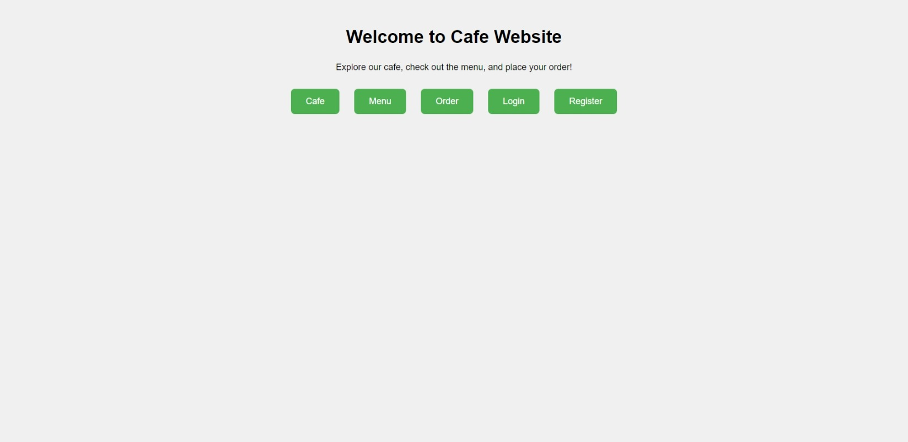

# Cafe Everywhere

<p align="center">
  </img>
</p>

Welcome to Cafe Everywhere, frontend with purpose to connecting Baristas and Customers. This documentation will guide you through setting up Cafe Everywhere frontend.

> Cafe Everywhere is a toy project and was only made in less than 2 days, for a college assignment.
 
### Prerequisites

Make sure you have the following installed on your system:

- [Rancher Desktop](https://rancherdesktop.io/) or [Docker](https://docs.docker.com/engine/install/)

### Setup

1. **Clone the Repository:**
   ```shell
   git clone https://github.com/michaelact/cafe-everywhere
   cd cafe-everywhere
   ```

2. **Start the Application:**
   ```shell
   docker compose -f docker-compose.dev.yml up -d
   ```

3. Access http://localhost:8000
